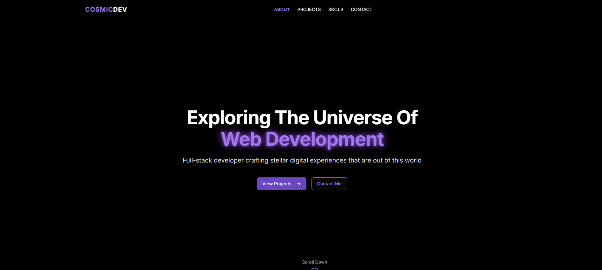

# 🚀 SpacePortfolio Template



A beautiful, modern, and fully responsive portfolio template for full-stack developers. Easily customizable—just edit a single config file to make it your own!

---

## ✨ Features
- Mobile-friendly & responsive design
- Animated hero section with rotating text
- Project showcase with images and tags
- Skills grid
- About and contact sections
- Smooth scrolling navigation with active section highlighting
- Easy configuration: **all your info in one file**
- Built with Next.js, React, and Tailwind CSS

---

## 🚦 Quick Start

1. **Clone this repo:**
   ```sh
   git clone https://github.com/YOUR-USERNAME/REPO-NAME.git
   cd REPO-NAME
   ```
2. **Install dependencies:**
   ```sh
   npm install
   ```
3. **Run the dev server:**
   ```sh
   npm run dev
   ```
4. Open [http://localhost:3000](http://localhost:3000) in your browser.

---

## 🛠️ How to Customize Your Portfolio

All your site's content (name, about, projects, skills, contact info, etc.) is in **`lib/siteConfig.ts`**.

### Example:
```ts
export const siteConfig = {
  hero: {
    title: "Exploring The Universe Of",
    rotating: ["Web Development", "Full Stack Development", ...],
    subtitle: "Full-stack developer crafting stellar digital experiences..."
  },
  about: {
    name: "Cosmic Explorer",
    description1: "I'm a passionate full-stack developer...",
    // ...
  },
  projects: [
    {
      title: "Nebula Dashboard",
      description: "A real-time analytics dashboard...",
      image: "/images/space.jpg",
      tags: ["React", "D3.js", "Firebase"]
    },
    // ...
  ],
  // ...
}
```

**To update your info:**
- Change your name, about text, and social links in `about`
- Add/edit projects in `projects` (add images to `public/images/` and reference them as `/images/your-image.png`)
- Update your skills in `skills`
- Change your contact email and message in `contact`
- Update footer links in `footer`

**No need to touch the main code!**

---

## 🖼️ Demo Image
You can replace `images/demo.png` with your own screenshot or hero image. For project images, add them to `public/images/` and reference as `/images/your-image.png` in `siteConfig.ts`.

---

## 🧰 Tech Stack
- [Next.js](https://nextjs.org/)
- [React](https://react.dev/)
- [Tailwind CSS](https://tailwindcss.com/)

---

## 📄 License
MIT — free for personal and commercial use. Please credit or star the repo if you use it! 